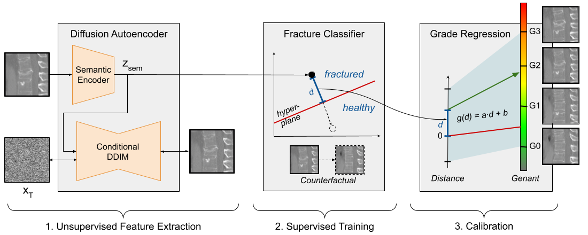

# Counterfactual Explanations for Medical Image Classification and Regression using Diffusion Autoencoder

## Abstract
Counterfactual explanations (CEs) aim to enhance the interpretability of machine learning models by illustrating how alterations in input features would affect the resulting predictions. Common CE approaches require an additional model and are typically constrained to binary counterfactuals. In contrast, we propose a novel method that operates directly on the latent space of a generative model, specifically a Diffusion Autoencoder (DAE). This approach offers inherent interpretability by enabling the generation of CEs and the continuous visualization of the model’s internal representation across decision boundaries.

Our method leverages the DAE’s ability to encode images into a semantically rich latent space in an unsupervised manner, eliminating the need for labeled data or separate feature extraction models. We show that these latent representations are helpful for medical condition classification and the ordinal regression of severity pathologies, such as vertebral compression fractures (VCF) and diabetic retinopathy (DR). Beyond binary CEs, our method supports the visualization of ordinal CEs using a linear model, providing deeper insights into the model’s decision-making process and enhancing interpretability.

Experiments across various medical imaging datasets demonstrate the method’s advantages in interpretability and versatility. The linear manifold of the DAE’s latent space allows for meaningful interpolation and manipulation, making it a powerful tool for exploring medical image properties.


**Method overview:** The proposed method involves three steps: 
1. Unsupervised training of a generative feature extractor Diffusion Autoencoder (DAE).
2. Supervised training of a binary classifier to detect a pathology and obtain a decision hyperplane.
3. Calibrating a linear regression of the pathology grade to the hyperplane distance of embedded images. 

The method inherently enables the generation of counterfactual explanations (CEs), visualizing the model's representation corresponding to regression grades and smooth progressions in between.

**Running on your dataset**

1. Training the DAE
    1. Add your dataset to the make_dataset() function in config.py, similar to how we handled our datasets. This should include any transformations and specific augmentations. 
    2. Create a copy of the training template in templates.py, e.g., copy brats64_autoenc() for 2d input. Make sure to update conf.data_name and conf.dataset_img_key. For 3d input, updading the underlying model architecture might be required, as we did in retina128_autoenc_130M().
    3. Finally, create a run script, e.g., by copying our run_brats64.py and run it. The trained DAE checkpoint would be saved to checkpoints/{conf.name}/
2. Infer semantic latents, train classifier and create counterfactuals- we will use manipuldate_spider.ipynb as an example.
    1. Use the trained DAE to encode all the dataset to sematic latents by calling model.encode() (cell "save prepcoessed latents").
    2. Train a binary classifier/regressor of your choice on these latents (cells "Binary classifier" and "Regression on distance from decision boundary").
    3. Create the counterfactuals (cells under "Editing images")
        1. Obtain both the semantic and stochastic latents for an image by calling both model.encode() and model.encode_stochastic(). The stochastic latent is needed for an accurate reconstruction of the image.
        2. Edit the semantic latent. We used the move_across_boundary() which extracts the decision boundary from the classifier.
        3. Reconstruct the image by calling model.render() using the manipulated semantic latent and the original stochastic latent.


## Citations
If you use this code or find our work useful, please cite our [paper](https://www.melba-journal.org/papers/2024:024.html):

```bibtex
@article{melba:2024:024:atad,
    title = "Counterfactual Explanations for Medical Image Classification and Regression using Diffusion Autoencoder",
    author = "Atad, Matan and Schinz, David and Moeller, Hendrik and Graf, Robert and Wiestler, Benedikt and Rueckert, Daniel and Navab, Nassir and Kirschke, Jan S. and Keicher, Matthias",
    journal = "Machine Learning for Biomedical Imaging",
    volume = "2",
    issue = "iMIMIC 2023 special issue",
    year = "2024",
    pages = "2103--2125",
    issn = "2766-905X",
    doi = "https://doi.org/10.59275/j.melba.2024-4862",
    url = "https://melba-journal.org/2024:024"
}
```

## Acknowledgment
This work uses the DAE implementation provided by the original authors. For more details and the original codebase, visit the [official DAE repository](https://github.com/preechakul/DAE).
